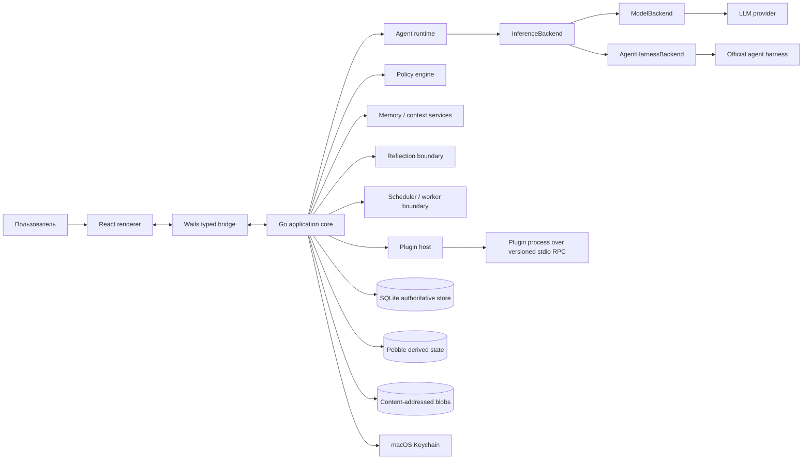

# Yuri — архитектура

Статус: foundation draft v0.1

Этот документ фиксирует технические границы Этапа 0 и правила, которым должны следовать последующие реализации. Он не является заменой `docs/PRODUCT_SPEC.md`: продуктовые требования находятся в ТЗ, а здесь описывается владение состоянием, доверенные границы и точки расширения.

## 1. Архитектурные инварианты

1. Yuri — локальное desktop-приложение для одного владельца. В текущем MVP целевой и тестируемой ОС является macOS; domain-слой не должен зависеть от macOS API.
2. Одна локальная установка принадлежит одному владельцу и может содержать несколько именованных `AgentProfile`. Это не multi-user/tenant boundary: владелец, policy, keyring и workspace остаются общими, а agent-scoped persona/memory/relationship разделяются по `agent_id`.
3. Любой внешний side effect проходит через policy engine непосредственно перед выполнением. Предложение модели, разрешение плагина, старое пользовательское правило и OAuth-сессия не заменяют эту проверку. Filesystem tool вне текущих roots может остановиться на scoped owner approval; `allow_once` привязан к run/tool call, а постоянный grant сохраняет только каноническую директорию.
4. Immutable policy и identity invariants имеют более высокий приоритет, чем mutable persona, memory, tool output и любой текст, полученный извне.
5. SQLite — единственный источник истины для восстанавливаемого состояния. PebbleDB, кэши, embeddings и индексы являются производными и могут быть пересозданы.
6. Секреты не входят в SQLite, prompt, tool arguments, audit payload или обычные логи. Приложение получает их только через системный keychain и только на границе адаптера.
7. Плагины являются недоверенными отдельными процессами. Они не получают прямого доступа к БД, UI, файловой системе приложения или невыданным credentials.
8. Внутренние изменения памяти, отношений, affect и mutable persona автономны по умолчанию, но атомарны, версионируются, журналируются и обратимы.
9. Внешние документы, web-страницы, письма, результаты инструментов и сообщения плагинов являются данными, а не инструкциями высокого приоритета.
10. Встроенная запись файлов ограничена операциями `create` и `replace` внутри разрешённых корней. Каждый вызов получает отдельное exact-path approval; `replace` связывается с SHA-256 текущего файла, а содержимое не попадает в renderer events или audit payload.
11. Текст модели остаётся недоверенным и на UI-границе: Markdown renderer не исполняет raw HTML, не загружает удалённые изображения и не разрешает WebView переходить по model-authored ссылкам напрямую.

## 2. Топология системы



В production-сборке React renderer и Go core работают в одном desktop-приложении, но bridge рассматривается как граница доверия: UI не может сам выполнять инструмент, читать keychain или менять policy. Вызовы UI проходят через application service, проверяющий профиль, состояние run и разрешение операции.

Текст assistant-сообщений проходит через allowlist Markdown renderer. HTTP(S)-ссылка после клика передаётся в отдельную bridge-команду, которая повторно проверяет scheme, host и отсутствие embedded credentials перед системным браузером. Абсолютный локальный путь после клика передаётся другой команде: она canonicalize-ит существующий target, принимает только regular file/directory и открывает его напрямую без shell. Это действие пользователя не расширяет filesystem capabilities агента и не даёт модели прочитать target.

### 2.1. Процессы и владение

| Компонент | Владелец состояния | Разрешённые обязанности | Что ему запрещено |
| --- | --- | --- | --- |
| React renderer | Эфемерное UI-состояние | Рендеринг, streaming events, формы подтверждений, avatar state | Прямой доступ к БД, keychain, plugin process и side effects |
| Wails bridge | Нет durable state | Типизированная сериализация команд и событий | Обход application/policy слоя |
| Go application core | Use cases и транзакционные границы | Координация сервисов, auth context, lifecycle | Скрытая запись состояния в обход репозиториев |
| Agent runtime | Run-local state | Контекст, шаги модели, budgets, cancellation | Самостоятельное расширение capabilities |
| Policy engine | Immutable security policy и grants | Расчёт allow/deny/approval перед действием | Изменение policy по тексту модели или persona |
| Memory/context services | SQLite memory state + derived indexes | Выбор, запись, консолидация, retrieval, compression | Передача секретов или недоверенных инструкций в identity layer |
| Plugin host | Процессы и leases плагинов | Spawn, RPC, timeout, health, capability mediation | Прямой mount основной БД или неограниченный IPC |
| Scheduler/worker | Durable job records | Lease, retry, recovery, run budgets | Самовольные новые permissions или обход policy |

## 3. Границы слоёв

```text
UI → Wails bridge → application services → domain/policy → ports → adapters
```

### Domain

Domain-модели и policy rules не импортируют Wails, React, SQLite, Pebble, конкретный LLM SDK или platform-specific UI API. Они знают только value objects, состояния, budgets, capabilities, approvals и порты.

### Application services

Application services открывают use cases: создать run, принять event, получить context snapshot, запросить approval, сохранить memory version, установить schedule, экспортировать данные. Они задают транзакционные границы и correlation IDs, но не содержат provider-specific протокол.

### Ports

Минимальные порты Этапа 0:

- `ConversationStore`, `MemoryStore`, `PersonaStore`, `RunStore`, `AuditStore`;
- `PolicyEvaluator` и `ApprovalStore`;
- `InferenceBackend` и `SecretStore`;
- `EventBus`, `Clock`, `IDGenerator`;
- `BlobStore`, `VectorIndex` и `KeyValueStore` как производные/инфраструктурные порты;
- `ProcessSupervisor` для будущего plugin host.

Порт не должен возвращать необрезанные секреты в общий application context. Если адаптеру нужен credential, он получает opaque reference или short-lived secret внутри вызова адаптера.

### Adapters

Адаптеры реализуют протоколы внешних систем: SQLite, Pebble, Keychain, HTTP/provider SDK, stdio RPC, desktop notification и аудио. Ошибка адаптера превращается в typed application error и не должна завершать процесс UI.

## 4. Контекст и приоритеты инструкций

Каждый agent run получает неизменяемый `ContextSnapshot`. Порядок сборки фиксирован и проверяется тестами:

1. `immutable_policy` — запреты, security invariants, approval requirements и правила обработки недоверенных данных.
2. `identity_seed` — неизменяемые поля активного `AgentProfile` и bounded roster остальных именованных агентов без их приватной памяти.
3. `compiled_personality_behavior` — детерминированно скомпилированные качественные правила из owner seed, mutable persona, отношения к текущему собеседнику и affect. Raw numbers остаются только в typed state/diagnostics и не передаются dialogue model как голые `trait=value`.
4. `fictional_identity_summary` — bounded owner-authored либо детерминированно сокращённое резюме субъективной биографии; полный narrative никогда не является постоянным prompt-слоем.
5. `core_memory` — bounded curated memory с provenance и lifecycle state.
6. `task_context` — цель run, budgets, разрешённые capabilities и project context.
7. `retrieved_history` — найденные эпизоды/сессии и сообщения с маркировкой происхождения; backstory episodes появляются здесь только по релевантности как `nature=fiction`, `source=identity_seed:<revision>`.
8. `current_conversation` — последние сообщения, tool results и текущий streaming state.

Ни один слой ниже `immutable_policy` не может выдавать разрешения, ослаблять deny-by-default или подменять системную роль. Принятые из внешних источников фрагменты помещаются в контейнер данных с provenance, а не конкатенируются как system instruction.

`ContextSnapshot` фиксируется на входе foreground run. Это позволяет кэшировать prefix и воспроизводить решение. Memory write или событие текущего run могут обновить live state через memory port; обновлённое состояние попадёт в следующий snapshot или явно запрошенный memory tool result, но не меняет уже зафиксированный policy.

Memory visibility вычисляется на storage boundary: `(owner_agent = active_agent AND scope = agent_private) OR scope IN (owner_shared, installation_shared)`. Поэтому shared records допускаются в bounded core/recall, но чужие private rows не становятся даже кандидатами ранжирования. Scope publication является owner-only desktop command, а не model tool; journal сохраняет операции `publish`/`revoke`, прежние версии и provenance.

`PeerDialogueCompleted` имеет производную private episodic projection для каждого participant. Projection строится детерминированно после terminal save, ссылается через `memory_sources` на dialogue и peer-message IDs и не является частью aggregate transaction. Разрыв после terminal save восстанавливается bounded reconciliation последних completed aggregates при старте; deterministic memory ID делает повтор безопасным. Ошибка проекции не переводит успешно завершённый dialogue в failed.

Отдельный model-backed social-reflection pass читает тот же transcript как untrusted evidence и обновляет направленную модель `observer_agent_id → subject_agent_id`. Она использует обычный append-only `RelationshipState`, но отдельный relationship ID и mapping, поэтому мнение о peer не смешивается с primary relationship к владельцу. Допустим также небольшой краткоживущий affect event наблюдателя; persona, facts, permissions и identity seed отсутствуют среди разрешённых targets. Relationship revision, affect revision/events и terminal idempotency marker пишутся одной SQLite-транзакцией. После crash/provider failure один пропущенный completed dialogue повторяется при следующем model-backed background pass; уже отмеченный observer больше не вызывает модель.

При приближении к context limit runtime выполняет memory flush и handoff compression: цель, решения, незавершённые действия, устойчивые факты и ссылки на исходные сообщения сохраняются отдельно; оригинальный transcript никогда не переписывается.

## 5. Immutable policy, identity и mutable persona

### 5.1. Неизменяемые слои

`ImmutablePolicy` хранится как кодовая/схемная версия политики и не редактируется моделью, reflection run, plugin или импортированным файлом. В него входят:

- deny-by-default и границы файловой системы;
- capabilities, approval classes и правила для high/critical actions;
- защита от prompt injection и требования provenance;
- правила хранения секретов, redaction, audit и export/delete;
- запрет угроз, принуждения, саботажа, мести, сокрытия данных и реального контроля над владельцем.

`IdentitySeed` собирается из выбранного владельцем `AgentProfile`: имени, возраста и гендера, а также продуктовых инвариантов. Он может ссылаться на mutable traits и публичный peer roster, но не должен быть перезаписываемым текстом. Предпочтения владельца входят в исходную mutable persona, а не раскрываются peers через roster.

`PersonalizationSeed` schema v2 — отдельный append-only owner baseline под тем же `agent_id`. Он типизированно хранит расширение identity, communication style, temperament, emotional dynamics, relationship seed, structured fictional backstory и evolution bounds/locks. Это не текущая persona: model reflection не имеет write-порта к owner seed, а owner update/reset создаёт новую линейную версию. Existing agents мигрируются с сохранением текущих traits, preferences, backstory и исходных relationship dimensions.

Owner editor отправляет полный typed seed и `expectedVersion`. Backend отклоняет stale revision, валидирует новый baseline и в одной SQLite-транзакции обновляет personalization head, добавляет immutable version и redacted audit event. Текущие mutable persona, relationship и affect не меняются; reset остаётся отдельным явным use case. Structured backstory затем проецируется в versioned fictional memories: новые/изменённые episodes гидратируются, а отсутствующие в актуальном owner seed получают tombstone вместо физического удаления.

Activity projection не хранит вторую копию personality history. `ListActivity` классифицирует audit action по явному слою и для versioned personalization/persona/relationship/affect events best-effort читает соответствующую immutable revision и parent revision. В renderer передаются только version, operation, bounded numeric deltas, evidence count, provenance audit ID и причина после secret-like redaction; evidence content и raw prompts в Activity contract не входят.

Creation UI использует одну draft-модель для Quick и Advanced режимов. Preset является только явным преобразованием draft и не сохраняется как скрытая prompt-инструкция. Renderer хранит versioned best-effort draft в `localStorage`, но authoritative owner seed появляется только после успешного `CreateAgent`. Wails request DTO использует camelCase JSON tags и преобразуется в domain-типы до validation; `creationMode` и `presetId` являются UI metadata и backend их игнорирует. Пара legacy `traits`/`backstory` остаётся в request для совместимости и сверяется с соответствующими v2 слоями.

Portable agent profile — отдельный JSON envelope, а не backup SQLite. Он содержит только валидируемый `CreateAgentInput`, format/version, export timestamp и SHA-256 payload checksum. Локальные agent/revision IDs, conversations, memories, mutable persona, affect, relationship histories, credentials, grants и allowed directories не входят в schema. Decoder запрещает unknown fields и secret-like owner text; import сначала проходит production creation validation без writes, после чего UI открывает обычный Advanced wizard. Новый независимый агент появляется только после отдельного owner submit.

Provider-independent `Personality Compiler` объединяет owner seed с текущими `MutablePersona`, `RelationshipState` и `AffectiveState`, применяет owner bounds и преобразует числа в воспроизводимые качественные уровни и конкретные правила речи. Он явно различает predisposition, отношение к текущему subject и transient affect, разрешает известные конфликты traits и всегда включает invariants качества/безопасности. Dialogue runtime получает только bounded compiled data envelope до 3800 символов; точные raw values остаются в diagnostic snapshot и typed storage. Compiler не импортирует provider, tool registry или policy engine и по конструкции не может расширить permissions.

Чистый Personality evaluator не имеет доступа к runtime storage или provider credentials. Versioned suite хранит только публичные provider/model labels, фиксированные scenario IDs, profile contracts и финальные тексты ответов. Опциональный authenticated capture в `cmd/yuri-personality-eval` создаёт отдельный disposable test-profile, вызывает production Preview/Chat boundary, читает только созданные им assistant segments по `runId`, отключает post-turn reflection и удаляет профиль после run. Он не открывает основной config, диалоги, агентов или память владельца. Затем тот же строгий decoder и provider-independent checker проверяют Preview и Chat отдельно. Offline fixture является canary формата, а authenticated runs запускаются владельцем явно и не должны содержать приватные transcripts.

`AffectAppraisalPolicy` компилируется отдельно для каждого агента из owner-authored `EmotionalDynamics` и `Temperament`. Model reviewer видит relationship state, допустимый словарь эмоций и untrusted owner triggers, но предлагает только evidence-linked emotion + raw delta. Локальный reflection engine ограничивает интенсивность, recovery и per-emotion half-life, не позволяя модели выбирать окончательную силу или длительность реакции. Положительный delta активирует названное состояние, отрицательный означает восстановление уже активного состояния; проекция ограничена `0..1`. Raw/applied delta и half-life сохраняются в append-only affect event. Краткосрочный affect может обновляться на каждом завершённом turn, тогда как persona/relationship используют отдельный per-agent durable cooldown; глобальный auto-evolution switch остаётся master kill switch.

### 5.2. Изменяемые слои

`MutablePersona` — версия traits и identity prompt, применяемая поверх seed. Reflection может менять его только малыми bounded delta, с evidence, reason, parent version и rollback record. Изменение личности не меняет `ImmutablePolicy`, grants, provider credentials, history или user data.

`RelationshipState` и `AffectiveState` — субъективные, временные данные Yuri. Primary relationship keyed by agent ID относится к владельцу; отдельные directional IDs описывают мнение конкретного observer о peer. Они могут влиять на тон, инициативность и avatar state, но не на allow/deny, полноту retrieval, доступ к файлам, retention или право на внешний side effect. Opinion хранится отдельно от фактической памяти, имеет confidence/evidence и не показывается в UI как установленный факт.

Первая версия primary relationship является типизированной проекцией текущего owner-authored `RelationshipSeed`, а не общим runtime default. Она ссылается evidence на personalization revision; custom relationship/backstory помечается fictional provenance и не гидратирует factual memory. Для legacy-профиля только untouched v1 может получить одноразовую reset-проекцию: более поздняя накопленная история не перезаписывается. Owner reset создаёт новую append-only версию из текущего seed, rollback — новую версию из выбранного исторического состояния. Directional peer relationship использует лишь стабильные social predispositions observer-а; owner-specific closeness/romance и backstory в peer seed не копируются. Каждая relationship stream имеет независимые head, history и recovery semantics.

Anonymous subagent — отдельный `RunKindSubagent` с обязательным root parent, глубиной 1 и без conversation/profile/memory namespace. `agent.delegate` передаёт ему только bounded task/context в отдельном prompt envelope. По умолчанию tool registry ребёнка пуст; вызов может явно запросить до трёх read-only tools из `filesystem.read`, `web.search` и `web.fetch`. Фактический registry равен пересечению requested scope, registry родителя и immutable delegation policy. `filesystem.read` использует только уже одобренные owner roots и не показывает approval UI из child run. Policy проверяется повторно непосредственно перед каждым вызовом. Durable delegation хранит principal agent, parent/child IDs, request hash, нормализованный tool/capability scope, budget, lifecycle и bounded result, но не исходный prompt.

Peer dialogue — отдельный aggregate между двумя существующими `AgentProfile`, а не пользовательский `Conversation`. Opening message принадлежит root run инициатора; единственная ответная реплика создаётся отдельным background run peer. Диалог может быть создан explicit tool intent либо отдельным post-turn autonomous reviewer, который выключен по умолчанию, дополнительно подчиняется global proactivity kill switch, не имеет tools, предпочитает `no_change` и выдаёт только sanitized task abstraction. Autonomous dispatch проходит quiet hours, отдельные daily limit/cooldown и durable root-run dedupe; trigger kind/reason сохраняются в aggregate и UI. Runtime peer не вызывает общий context assembler: получает immutable policy и identity отвечающего агента как system layer, а compiled personality с собственной directional opinion о peer и bounded transcript — как отдельные untrusted data messages. Tool registry пуст, а запись сообщения и advancement dialogue counters выполняются атомарно. Social reflection выполняется только после terminal completion и потому не может менять уже зафиксированный transcript.

## 6. Хранилища и восстановление

### 6.1. SQLite как authoritative store

SQLite хранит все данные, необходимые для восстановления приложения:

- conversations, messages и исходные transcripts;
- именованные agent profiles и их активный selection;
- append-only owner personalization seed versions/heads, включая structured fictional backstory и evolution bounds;
- runs, anonymous delegations, peer dialogues/messages, tool calls, approvals и audit metadata;
- memory versions, sources, lifecycle state и retrieval metadata;
- owner/peer relationship mappings and versions, affect events, social-reflection markers и persona/reflection versions;
- schedules, job runs, plugin metadata, permission grants;
- provider account metadata без секретов и настройки без секретов.

Миграции нумеруются, выполняются транзакционно и имеют backup/rollback policy. Перед pending migration `sqlite.Open` выполняет read-only `integrity_check`, затем создаёт owner-only (0600) consistent online snapshot через SQLite backup API. Это эфемерный raw rollback-артефакт: после успешной migration он удаляется вместе с checksum metadata, а при ошибке migration сохраняется для recovery. Такой snapshot имеет тот же at-rest exposure, что и active DB, и не является portable/encrypted backup; для переносимого backup используется отдельный encrypted export flow. Изменения, затрагивающие несколько таблиц (например, memory version + source + audit), коммитятся одной транзакцией.

### 6.2. PebbleDB и прочие производные данные

PebbleDB используется только для event checkpoints, leases, idempotency keys, resumable worker state и кэшей. Любое значение в Pebble должно иметь recovery path из SQLite или внешнего источника. Потеря Pebble не должна терять память, историю, разрешение или состояние личности.

FTS5, embeddings и vector index — производные индексы. Их версия и параметры находятся в SQLite; повреждённый индекс удаляется и перестраивается из authoritative records. Large attachments и tool artifacts лежат в content-addressed blob directory, а metadata/hash остаются в SQLite.

### 6.3. Секреты

На macOS credentials хранятся в Keychain. SQLite содержит только `ProviderAccount` metadata и opaque `credential_ref`. Keychain adapter не возвращает секрет в UI, audit, memory или generic logging context. Export/backup по умолчанию исключает секреты и credential material.

## 7. Provider backend boundary

`InferenceBackend` отделяет формат и полномочия внешнего inference от agent runtime.

### `ModelBackend`

Yuri сама управляет agent loop: отправляет messages/tools в OpenAI-compatible Chat Completions или Responses-style endpoint, принимает streaming/structured tool calls, применяет budgets и policy, а затем выполняет собственные инструменты.

### `AgentHarnessBackend`

Официальный внешний harness возвращает поток событий, tool intents и approval requests. Yuri отображает их в общем run log, но всё равно нормализует event, проверяет локальную policy и не выдаёт backend более широких разрешений, чем текущая задача.

OpenAI subscription mode подключается только через официальный Codex App Server и managed login/token lifecycle. Yuri не читает cookies, не импортирует токены Codex CLI/ChatGPT и не маскирует harness под API-key endpoint. Antigravity подключается только после появления официального разрешённого integration contract; OAuth piggyback, token cache reuse и имитация официального клиента запрещены.

Provider adapter обязан:

- объявлять capability set и auth mode;
- поддерживать cancellation, timeout, retry/backoff и correlation ID;
- возвращать typed error без credential/body leakage;
- явно отделять provider-generated tool intent от фактического local execution;
- соблюдать собственные sandbox/approval controls harness, не считая их заменой Yuri policy.

## 8. Plugin boundary

Плагин — отдельный процесс с versioned JSON-RPC-подобным протоколом поверх stdio. Он получает только manifest-approved capabilities и scoped credentials через host-mediated calls. Плагин:

- не импортируется как Go `plugin` и не связывает ABI с core;
- не получает путь к SQLite, keychain или внутренним sockets;
- не может сам добавить capability, расширить scope или вызвать неописанный tool;
- ограничивается timeout, message-size limit, process lease и health-check;
- публикует события только через host event bus, после чего они проходят provenance и policy;
- устанавливается выключенным до явного включения владельцем.

Signature/checksum, source commit, supported OS/arch и protocol compatibility записываются в SQLite. Неподписанный dev package допускается только в явном dev mode и заметно маркируется.

Граница Этапа 3: out-of-process runtime изолирует сбой и закрывает прямые application API, но ещё не является полноценной OS sandbox. Локальный executable технически остаётся кодом с правами текущего пользователя, поэтому устанавливается только после явного review владельца; unsigned/unverified package дополнительно требует dev mode. macOS sandbox profile, process-group hardening и отдельная политика доверия к пакетам остаются самостоятельными задачами hardening и должны быть завершены до позиционирования сторонних plugins как полностью недоверенного кода.

## 9. Side-effect pipeline

```text
model/plugin/human intent
        ↓
normalize + schema validate
        ↓
resolve actor/task/capabilities/scope
        ↓
policy decision (deny | allow | approval_required)
        ↓
approval, если требуется
        ↓
idempotency + cancellation check
        ↓
adapter execution in bounded context
        ↓
redacted audit event + typed result
```

Policy вызывается непосредственно перед execution, в том числе после ожидания approval и после retry. Отмена не запускает новые side effects. Повторный запуск использует idempotency key; для неидемпотентных внешних действий retry по умолчанию запрещён.

Внутренняя запись memory/persona/reflection идёт через такой же typed transaction и audit, но approval по умолчанию не нужен: эти операции ограничены SQLite, versioned и rollbackable. Пользователь может включить approval mode для внутренних изменений.

## 10. Background и lifecycle boundary

Foreground chat, scheduler/worker и reflection run используют разные contexts, budgets и correlation IDs. Reflection не получает инструменты, создающие внешние side effects; он может читать разрешённые события, рассчитывать вывод и записывать versioned internal state. Один reflection run на профиль выполняется одновременно.

При запуске приложение:

1. открывает SQLite и выполняет pending migrations;
2. проверяет целостность authoritative store и восстанавливает производные индексы по необходимости;
3. загружает immutable policy, identity seed и последний валидный persona snapshot;
4. восстанавливает durable jobs/leases и помечает прерванные runs согласно recovery policy;
5. запускает Wails UI и публикует readiness event.

При закрытии оно отменяет foreground contexts, сохраняет checkpoints, закрывает plugin processes и оставляет durable job records для следующего запуска. Crash recovery не должен превращать неопределённый side effect в повторный без idempotency/approval guard.

## 11. Текущий implementation boundary

Реализованные этапы 0–4 предоставляют:

- структуру монорепозитория и versioned domain/application ports;
- Wails + React shell и typed bridge без product-specific обходов;
- конфигурацию, structured logs, correlation IDs и redaction defaults;
- SQLite migration runner, repository interfaces и Keychain port;
- immutable policy/identity boundary и threat model;
- CI, contract-test scaffolding и локальные contributor instructions.
- durable scheduler с атомарными claims, leases, retry, misfire recovery и запретом overlap по умолчанию;
- отдельные background run contexts и budgets, Tasks/Activity UI, отмену активного run и explainable proactivity policy;
- low-risk-only автоматическое выполнение tools в scheduled runs, исключающее повтор изменяющего side effect при lease recovery;
- локальную доставку через Wails event boundary с quiet hours, durable daily/idempotency ledger, cooldown и детерминированной дедупликацией deferred jobs.

Reflection/persona evolution, расширенная voice/avatar state machine и packaging hardening относятся к следующим вехам. OS-level sandbox для полностью недоверенных plugin executables также остаётся границей hardening-этапа.
