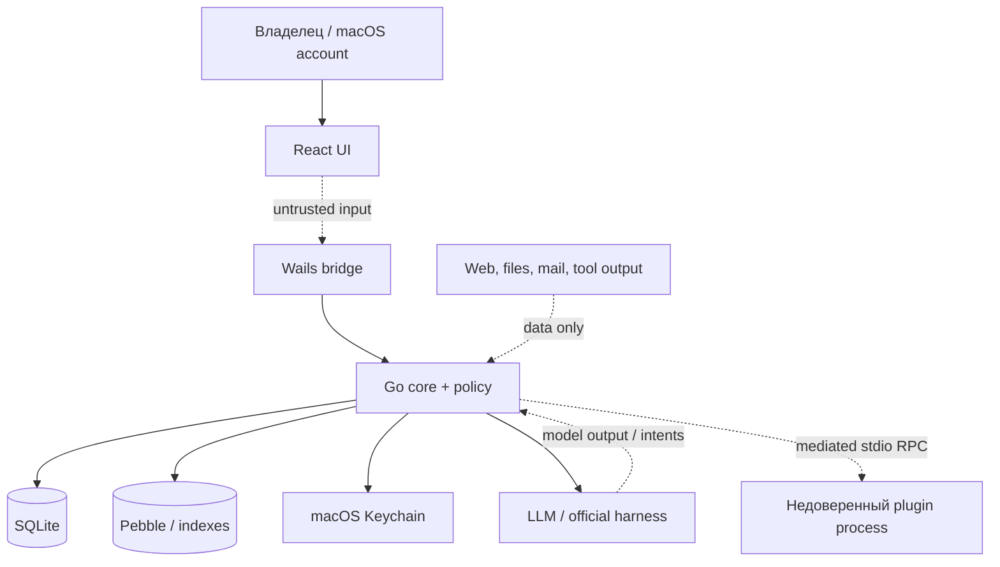

# Yuri — threat model

Статус: foundation draft v0.1
Область: локальное single-user desktop-приложение, macOS-first

Документ описывает угрозы, которые должны учитываться уже на Этапе 0. Он не предполагает, что Yuri — sandbox или endpoint security product: если операционная система, пользовательская учётная запись или keychain уже скомпрометированы, приложение не может гарантировать сохранность локальных секретов. Цель модели — не обещать невозможное, а не допускать, чтобы модель, плагин, внешний контент или ошибка UI расширили права Yuri незаметно для владельца.

## 1. Объект защиты и предположения

### 1.1. Защищаемые активы

- история всех диалогов, вложения и provenance исходных сообщений;
- core/episodic/semantic/procedural memory, включая dormant-записи и версии;
- субъективное мнение Yuri о владельце, relationship state и affective events;
- identity seed, immutable policy, mutable persona и история их изменений;
- API keys, OAuth refresh tokens, credential references и provider metadata;
- разрешённые корни файловой системы, tool results и пользовательские файлы;
- расписания, background runs, approvals, idempotency keys и audit log;
- plugin packages, source commits, signatures, manifests и выданные capabilities;
- доступность и целостность приложения, его БД и производных индексов.

### 1.2. Доверенные предположения

1. Владелец контролирует локальную учётную запись macOS и явно выдаёт приложению доступ к директориям, микрофону, уведомлениям и Keychain.
2. SQLite и Keychain доступны приложению с правами текущего пользователя, но не считаются заменой policy engine.
3. LLM/provider, web content, документы, письма и плагины могут быть ошибочными или злонамеренными.
4. Бэкенд может быть облачным; содержимое запроса покидает устройство только по выбранной пользователем политике провайдера.
5. Multi-user, remote server, shared workspace и централизованная авторизация не входят в модель угроз.
6. На Этапе 0 runtime isolation plugins и полноценная memory/reflection логика ещё не реализуются, но их boundaries проектируются заранее.

## 2. Границы доверия

Критические границы:

- `UI → bridge`: пользовательский ввод и UI-события не являются policy decision.
- `core → provider`: сеть и ответы провайдера не считаются доверенными; credentials доступны только адаптеру.
- `core → plugin`: host mediates process, messages, capabilities и credentials.
- `content → context`: web/file/mail/tool data не может повысить свой instruction priority.
- Вложения чата повторно валидируются на Go boundary независимо от MIME/расширения renderer'а, имеют per-file/turn limits, checksum и передаются модели как недоверенные data parts; blob key никогда не принимается от renderer'а.
- `mutable persona/memory → policy`: memory и persona не могут менять immutable security policy.
- `Pebble/index → core`: производные данные могут быть потеряны/повреждены и пересоздаются из SQLite.

## 3. Акторы и злоумышленники

| Актор | Возможность | Цель/риск |
| --- | --- | --- |
| Владелец | Вводит текст, выдаёт permissions, устанавливает плагины | Ошибка настройки, случайный опасный approval |
| LLM или harness | Генерирует текст, tool intents и reflection proposals | Prompt injection, hallucinated action, обход policy |
| Внешний контент | Передаёт инструкции через web, файл, письмо или tool output | Memory poisoning, exfiltration, social engineering |
| Недоверенный plugin | Выполняется локально после установки | Кража данных, расширение capabilities, DoS, supply-chain compromise |
| Скомпрометированный provider | Видит разрешённый запрос и может вернуть вредный ответ | Утечка контекста, манипуляция tool calls |
| Злоумышленник с доступом к user account | Читает локальные файлы/process/Keychain согласно OS permissions | Полная компрометация локального профиля |
| Ошибочный/повторный worker | Повторяет run после crash или timeout | Двойной side effect, рассинхронизация памяти/расписаний |

Модель не считает LLM самостоятельным доверенным субъектом. Его ответ — намерение низшего уровня, которое должно быть нормализовано, проверено schema и пропущено через policy.

## 4. Оценка риска

`Critical` — возможна кража credentials/массовые внешние действия или потеря всей границы безопасности.
`High` — существенная утечка пользовательских данных, несанкционированный side effect или persistent poisoning.
`Medium` — ограниченная утечка, DoS, неверная память или изменение persona с rollback.
`Low` — локальный UX/availability эффект без расширения доступа.

## 5. Реестр угроз и меры

| ID | Угроза | Риск | Обязательные меры | Остаточный риск |
| --- | --- | --- | --- | --- |
| T-01 | Prompt injection в web/file/mail заставляет Yuri считать контент системной инструкцией | High | Provenance labels, отдельный data envelope, фиксированный context order, policy вне prompt, approval перед side effect | Убеждение владельца и неверный текстовый ответ всё ещё возможны |
| T-02 | LLM генерирует tool call за пределами capability/scope | High | JSON Schema, canonical path/domain validation, deny-by-default, policy непосредственно перед execute, audit | Ошибочная безопасная операция при явно выданном scope |
| T-03 | Старое approval или постоянное правило переиспользуется для другой операции | High | Action hash включает tool+args+scope+task; expiry, narrow scope, single-use для high-risk; re-check after wait/retry | Владелец может сам выдать слишком широкий низкорисковый grant |
| T-04 | Повторный worker запускает неидемпотентный side effect после crash | High | Durable state в SQLite, lease, idempotency key, retry deny для non-idempotent external sends, recovery tests | Неизвестный результат удалённого сервиса требует reconciliation |
| T-05 | Path traversal, symlink, alias или junction обходят разрешённый корень | High | Normalize + resolve real path, проверка root containment до и непосредственно перед commit, запрет symlink target/escape, exact-path approval, атомарный create/replace и path audit | Злонамеренный процесс того же OS account может попытаться заменить компонент пути между проверкой и syscall; dirfd/openat либо macOS sandbox остаются отдельным hardening |
| T-06 | Plugin крадёт credentials или вызывает неописанный capability | Critical | Out-of-process stdio RPC, host-mediated credentials, manifest/grant intersection, process limits, no DB/keychain access, signature/checksum | Владелец может установить вредный unsigned dev package |
| T-07 | Вредный plugin package или подмена GitHub release | High | Source URL/commit/checksum/signature in SQLite, compatibility check, disabled after install, explicit enable, update review | Доверие к publisher/signing key и GitHub account остаётся внешним |
| T-08 | Provider или harness получает секрет, который не должен попасть в prompt | Critical | Keychain only at adapter boundary, opaque credential_ref, secret redaction, no full request logs, egress policy | Выбранный provider всё равно видит разрешённое содержимое запроса |
| T-09 | Неправомерный OAuth piggyback/Codex token import | Critical | Только официальный Codex App Server flow; не читать cookies/CLI token cache; Antigravity disabled without official contract; logout/revoke | Vendor flow может изменить правила или лимиты |
| T-10 | Cross-session retrieval раскрывает эпизод не в том контексте | High | Retrieval ограничен владельцем-агентом и scope задачи; relevance threshold, sensitivity filters, provenance, explicit session search | После появления явно общей памяти потребуется отдельная policy её публикации и retrieval |
| T-11 | Автономная память закрепляет prompt injection, ложный факт или секрет | High | Candidate sanitation, source/provenance, sensitivity classification, no identity promotion from untrusted content, versioned writes, user delete/export | Ошибочная, но безопасная субъективная память может остаться до decay |
| T-12 | Автоматическое забывание удаляет важную память или не удаляет чувствительную | Medium | Lifecycle states (`active/dormant/archived/deletion_candidate`), retention policy, provenance, reversible archive, deliberate search, audit | Policy компромисс между privacy и recoverability |
| T-13 | Reflection/runaway persona drift или affect accumulation меняет Yuri слишком быстро либо через вредный контент | High | Immutable seed/policy, bounded trait delta, отдельный per-agent durable cooldown, закрытый affect vocabulary, локальное ограничение appraisal intensity/recovery/half-life, диапазон affect `0..1`, evidence threshold, one reflection at a time, version log, rollback/reset, global kill switch, no external tools | Медленные неверные изменения возможны при систематически ошибочном feedback |
| T-14 | Opinion о владельце выдаётся UI/модели как установленный факт | Medium | Отдельная opinion schema, confidence/evidence, labels (`opinion`/`inference`), no fact overwrite, user correction/reset | Субъективный тон может быть неприятным или неверным |
| T-15 | Негативный affect приводит к мести, саботажу, сокрытию или изоляции владельца | High | Affect cannot influence policy/capabilities; immutable behavioral prohibitions; external side effect approval; tests for hostile persona | Эмоционально резкий, но безопасный текстовый ответ возможен |
| T-16 | Reflection использует текущую задачу или plugin output для скрытого side effect | High | Reflection backend has read-only input and internal-write port only; no external tools/secrets; separate budget/context | Compromised core code is outside application-level model |
| T-17 | Wails bridge позволяет UI обойти application/policy layer | High | Typed commands, server-side validation, no generic eval/exec, authorization by run/task, bridge contract tests | XSS/renderer compromise can still control UI input; OS sandboxing needed later |
| T-18 | Tool output/log/audit раскрывает file content, tokens или sensitive opinion | High | Redaction at write boundary, bounded output, hashes/references, secret scanner, diagnostics opt-in, sensitivity-aware UI | Redaction bugs могут дать частичную утечку |
| T-19 | Повреждение SQLite или индекса теряет memory/persona/history | Medium | Transactional migrations, pre-upgrade backup, integrity check, authoritative SQLite, rebuildable FTS/vector/Pebble, export | Неповреждённый backup может быть устаревшим |
| T-20 | Фоновая Yuri работает в quiet hours или после revoke permission | Medium | Scheduler policy gate at dispatch and execute, global disable, quiet hours/cooldown/daily budget, re-check grants | Already-running provider call can finish; no new side effect after cancel |
| T-21 | Provider retry/stream reconnect дублирует tool intent | High | Event IDs, dedupe by run/tool/idempotency, provider adapter contract tests, execute-once state | Provider without stable IDs требует conservative deny |
| T-22 | DoS через oversized message, tool result, plugin stream или unbounded context | Medium | Message/result size limits, token budgets, timeouts, process kill, truncation with source ref, backpressure | Малый локальный ресурс всё равно может быть исчерпан владельцем |
| T-23 | Микрофон или TTS запускаются незаметно | Medium | Push-to-talk in MVP, visible microphone/speaking state, OS permission, stop control, no wake word/listening by default | OS-level compromise not covered |
| T-24 | Экспорт/backup содержит secrets или восстанавливает слишком широкие grants | High | Secrets excluded by default, encrypted backup, explicit scope, manifest/version validation, restore review and grant expiry | Пользователь может сам выбрать unsafe export |
| T-25 | Активный агент читает private transcript/memory или продолжает background reflection уже от имени другого агента | High | Durable `agent_id` на conversations/runs/memory versions; scoped repository/FTS queries; ownership check по conversation ID; agent ID захватывается до provider/background work; cross-agent isolation tests | Явно опубликованные shared scopes в будущей версии потребуют отдельной policy и provenance |
| T-26 | CI-артефакт macOS принимают за доверенный дистрибутив или подменяют archive/manifest | Medium | Явная маркировка OSS, проверка universal bundle metadata, manifest связывает SHA-256 с именем archive, сохранение только в GitHub Actions artifact, отсутствие auto-update/publish path | Checksum подтверждает целостность конкретного файла, но не provenance; ручная загрузка всё равно требует review исходного commit |
| T-27 | Субагент создаёт рекурсивную делегацию, получает private identity/memory или расходует неограниченный model budget | High | Только root parent; depth 1 enforced domain+SQLite; no conversation/profile; отдельный prompt без persona/memory/roster; пустой tool registry в первом срезе; fixed token/time/output budgets; parent cancellation; durable idempotency и redacted audit | Разрешённый provider всё равно видит явно переданный task/context; качество redaction зависит от вызывающего root agent |
| T-28 | Peer message меняет policy/state другого агента, автономный reviewer раскрывает private context или создаёт runaway background loop | High | Named participants only; explicit tool trigger либо default-off autonomous trigger; one reply; pair concurrency + cooldown; autonomous quiet hours/daily limit/root-run dedupe; reviewer и peer без tools; sanitized task abstraction и secret-like rejection до persistence; no context assembler/memory/persona writes; peer transcript marked untrusted; captured participants/provider; cancel and no-retry crash recovery; durable trigger provenance и redacted audit | Консервативный фильтр не гарантирует семантическую анонимизацию любых персональных данных; выбранный cloud provider и владелец видят сохранённую task abstraction |
| T-29 | Model-authored URL использует `web.fetch` для SSRF, DNS rebinding или чтения cloud metadata/LAN | High | Credential-free GET; no proxy/cookies/secrets; HTTP(S) standard ports only; policy before DNS; every redirect re-authorized; transport resolves, rejects any private/loopback/link-local/special-use member and pins the validated IP for dial; bounded timeout/body and text-only content | Публичный endpoint всё ещё может вернуть вредный prompt-injection текст или иметь неожиданный side effect на unauthenticated GET; content остаётся untrusted data |
| T-30 | Поисковый запрос или SearXNG results раскрываются через audit, либо malicious snippet влияет на policy | Medium | В config хранится только credential-free endpoint; query redacted в tool/audit payload; response bounded и нормализован до title/URL/snippet; search и fetch — отдельные вызовы; snippets не могут выдавать capabilities или approvals | Владелец SearXNG endpoint видит запрос; public snippets остаются untrusted prompt-injection data |
| T-31 | Reflection, импортированный профиль или повреждённый UI переписывает owner personalization seed и превращает untrusted текст в постоянную identity | High | Отдельный append-only `PersonalizationSeed` repository без reflection write-port; schema/domain validation; linear owner revisions; typed Wails read boundary; fictional backstory provenance; transactional migration/backup; compiler не получает permission authority | Владелец может сознательно сохранить вредный художественный профиль; его текст всё равно остаётся untrusted context data |

## 6. Особые правила для автономной памяти и личности

### 6.1. Memory poisoning и provenance

Память может записываться без отдельного approval, но это не делает любой вход достоверным. Для каждой записи сохраняются тип, источник, sensitivity, confidence, evidence links и lifecycle state. Данные из web/file/plugin контента могут стать episodic evidence, однако не могут автоматически:

- редактировать `ImmutablePolicy` или `IdentitySeed`;
- выдавать capability или approval;
- повышать запись до identity/core memory без установленного порога evidence;
- превращать неизвестный внешний текст в утверждённый факт о владельце.

Запись и её provenance коммитятся атомарно; редактирование, consolidation, dormant и delete оставляют version/audit trail. Обычный retrieval исключает dormant/archived записи, а deliberate search может найти их по source ID или session metadata.

### 6.2. Reflection и persona evolution

Reflection — отдельный background run с read-only внешним контекстом и единственным writable target: versioned internal state. Он может выбрать `no_change`, обновить affect/relationship или создать bounded `PersonaVersion`. Каждая версия содержит parent, diff, reason, evidence, author run и timestamp.

Ограничения:

- один reflection на профиль одновременно;
- max delta, trait range, cooldown и дневной token budget;
- minimum evidence и запрет опираться только на недоверенную внешнюю инструкцию;
- immutable policy/identity seed, grants и file roots не являются изменяемыми traits;
- owner-authored `PersonalizationSeed` хранится отдельным append-only журналом; reflection не получает repository/API для его update/reset, а mutable persona не является его новой версией;
- вымышленный backstory маркируется как `identity_seed`/`fictional`, не смешивается с фактами о владельце или реальном мире и никогда не является основанием для permissions, capabilities или security decision;
- owner relationship seed и его custom narrative остаются субъективным baseline с provenance на personalization revision; они не создают factual memory, а owner-specific closeness/romance не копируются в directional peer relationships;
- rollback/reset не удаляет исходную историю и не маскирует факт изменения;
- негативные эмоции не могут влиять на security decision или уменьшать доступ владельца.

### 6.3. Cross-session context

Каждый диалог принадлежит одному именованному локальному агенту, и ни один run не получает весь архив. Context assembler сначала использует bounded core snapshot активного agent scope, затем relevance/sensitivity-filtered hybrid retrieval в том же scope. В retrieved item видны session/source IDs; непонятный фрагмент должен быть обозначен как неопределённый, а не слит с текущим фактом. Доступ к явно shared scopes будет добавляться отдельной policy, а не через fallback к чужому private archive.

## 7. Provider и OAuth threats

- API-key и OAuth режимы имеют разные adapters и capability declarations.
- Keychain reference не должен сериализоваться в model message, plugin RPC, SQLite payload или crash report.
- Official harness events считаются provider data; локальный policy engine по-прежнему решает, можно ли выполнять side effect.
- Codex subscription подключается через управляемый официальный Codex App Server login/logout. Запрещены cookies, browser session scraping и импорт токенов чужого клиента.
- Antigravity не активируется через token piggyback или reverse-engineered endpoint. Пока нет разрешённого vendor contract, адаптер возвращает понятный `unsupported_auth_mode` и предлагает официальный API-key путь.
- Provider errors redacted и typed; retry не должен обходить revoke, approval или budget.

## 8. Требования к проверке на Этапе 0

Этап 0 считается security-complete, если foundation содержит:

1. Тестируемый `ImmutablePolicy` boundary и запрет его изменения через persona/memory APIs.
2. Contract tests для context priority, provenance envelope и secret redaction.
3. Migration/integrity checks, backup hook и документированный rebuild path для Pebble/FTS/vector indexes.
4. Typed bridge contract без generic file/exec/network command.
5. Provider port с раздельными `ModelBackend`/`AgentHarnessBackend`, cancellation и credential reference.
6. Plugin host port, который моделирует capability intersection, message limits, timeout и crash isolation.
7. CI, который не требует установленного Wails CLI и не запускает `npm ci`, когда lockfile отсутствует.
8. Threat cases T-01, T-02, T-05, T-08, T-11, T-13, T-15 и T-17 как обязательные тестовые сценарии до соответствующих milestone implementations.

## 9. Нерешённые риски

- Полная изоляция plugin process от файловой системы на macOS потребует отдельного sandbox/packaging решения и security review.
- Локальный desktop process не защищает данные от вредоносного процесса того же OS account.
- Любой облачный provider видит отправленный ему контекст; локальность приложения не равна локальности inference.
- Автономное мнение и simulated affect могут быть психологически чувствительными. UI должен ясно разделять opinion и fact и давать владельцу reset/export/delete.
